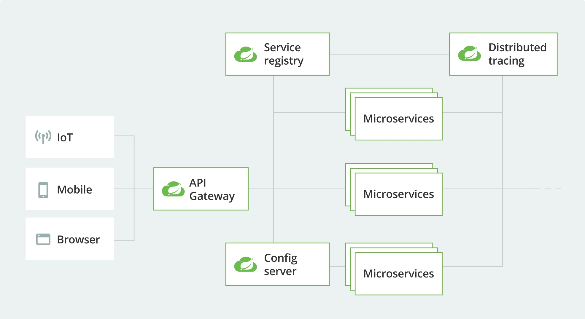

# spring-cloud 介绍

- 文档

https://spring.io/cloud

- 架构图

# 组件

## Service discovery 服务发现

### [Eureka](https://spring.io/projects/spring-cloud-netflix)

#### [详细说明](Eureka.md)

### [Consul](https://spring.io/projects/spring-cloud-consul)

#### [详细说明](Consul.md)

### [Zookeeper](https://spring.io/projects/spring-cloud-zookeeper)

###  [Kubernetes](https://spring.io/projects/spring-cloud-kubernetes)

## API gateway API 网关

## Cloud configuration 配置中心

## Circuit breakers 断路器

## Tracing 链路追踪

